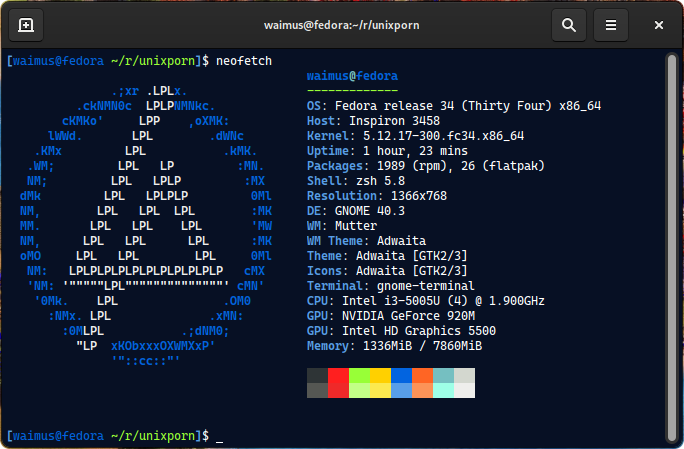

# ASCII Logos
Various logos converted to ASCII art using `jp2a`. You can use this in Neofetch.

## Usage with Neofetch
```bash
neofetch --source /path/to/file.txt
```


## Notice
All rights of the logo belong to the respective owner.
